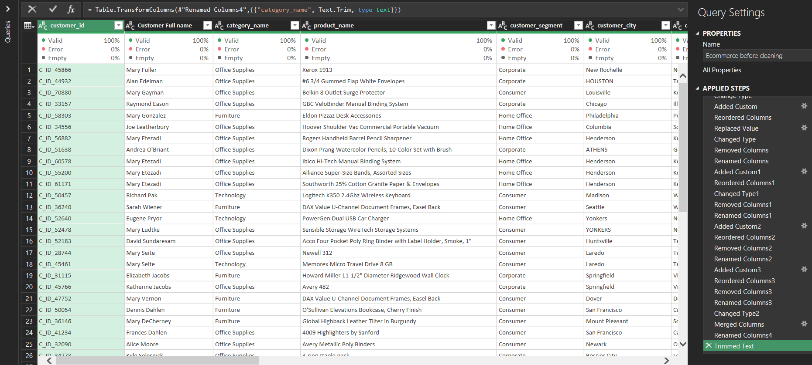
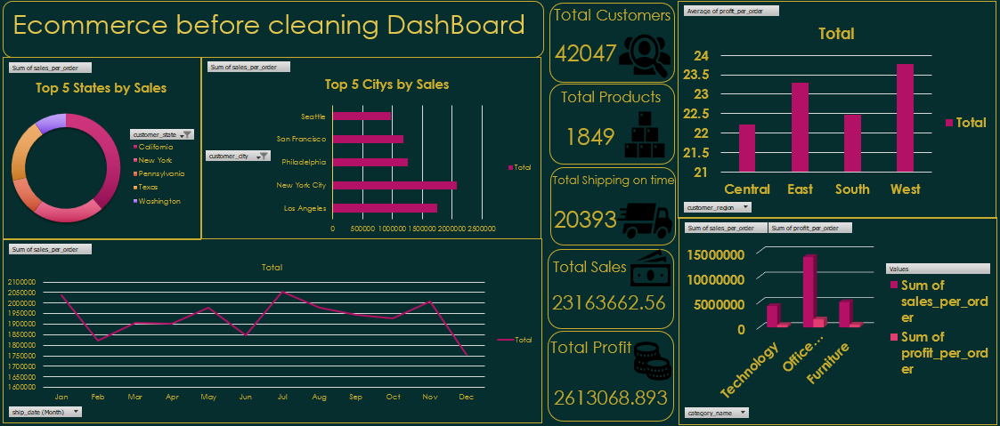
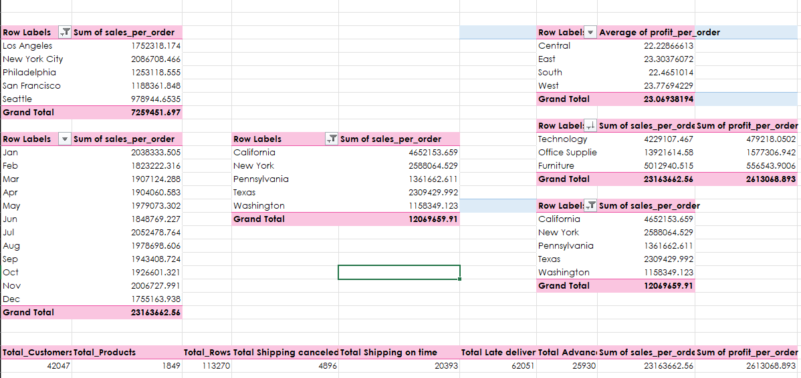

# 🛒 E-commerce Sales Analysis

## 📌 Overview
This project analyzes e-commerce sales data using Excel to uncover trends in customer behavior, product performance, and business insights.  
The project includes data cleaning, exploratory data analysis (EDA), and an interactive dashboard.

---

## 🧹 Data Cleaning (Power Query)

- Removed inconsistencies and cleaned raw data  
- Trimmed text and standardized columns  
- Prepared dataset for analysis  

---

## 📊 Dashboard (after Cleaning)

- Built interactive dashboard with KPIs  
- Sales trends over time  
- Top cities and states by sales  
- Category-wise performance  

---

## 📈 Pivot Tables & Analysis

- Monthly sales analysis  
- Regional performance comparison  
- Profit and sales breakdown  
- Key aggregated metrics  

---

## 📊 Key Insights
- Identified top-performing cities like New York and Los Angeles  
- Office Supplies generated the highest sales volume  
- Sales showed fluctuations across months with peak periods  
- Regional performance varies significantly across states  

---

## 🛠️ Tools Used
- Microsoft Excel  
- Power Query  
- Pivot Tables  
- Data Visualization  

---

## 🚀 Outcome
Transformed raw data into meaningful insights and built a dashboard to support data-driven decision-making.
